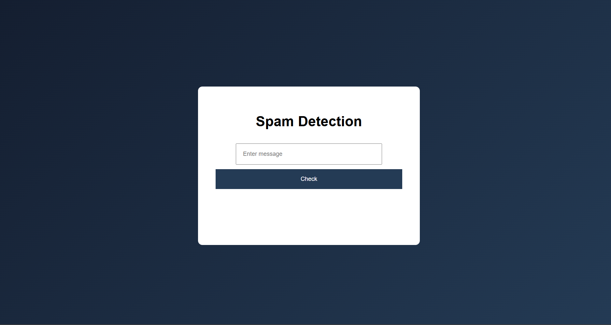

# 📧 Spam Detection System (ML + Flask)

A Machine Learning based web application that detects whether a message is **Spam** or **Ham (Not Spam)**. This project uses Natural Language Processing and a trained classification model with a modern web interface.

---

## 🚀 Features

* 🔍 Detect Spam or Ham messages instantly
* 🤖 Machine Learning prediction using trained model
* ⚡ Fast and accurate results
* 🎨 Clean and responsive user interface
* 💾 Model and vectorizer saved using Pickle

---

## 🧠 Machine Learning Information

* Algorithm: Multinomial Naive Bayes
* Text Vectorization: TF-IDF Vectorizer
* Dataset: SMS Spam Collection Dataset
* Accuracy: ~97%

---

## 🛠️ Technologies Used

**Frontend**

* HTML
* CSS
* JavaScript

**Backend**

* Python
* Flask

**Machine Learning**

* Scikit-learn
* Pandas
* NumPy

---

## 📂 Project Structure

spam-detection
│── app.py
│── requirements.txt
│── screenshot.png

├── model/
│   ├── spam_model.pkl
│   └── vectorizer.pkl

├── dataset/
│   └── spam.csv

├── templates/
│   └── index.html

├── static/
│   └── style.css

---

## ▶️ How to Run the Project

### Step 1: Clone repository

git clone https://github.com/kowshik2917n/spam-detection.git

### Step 2: Go to project folder

cd spam-detection

### Step 3: Install dependencies

pip install -r requirements.txt

### Step 4: Run the application

python app.py

### Step 5: Open browser

http://127.0.0.1:5000

---

## 📸 Screenshot

---

## 📊 Dataset

SMS Spam Collection Dataset
Contains 5000+ labeled SMS messages.

---

## 👨‍💻 Author

**Kowshik Kolla**

GitHub: https://github.com/kowshik2917n

---

## ⭐ Support

If you like this project, please give it a ⭐ on GitHub.
